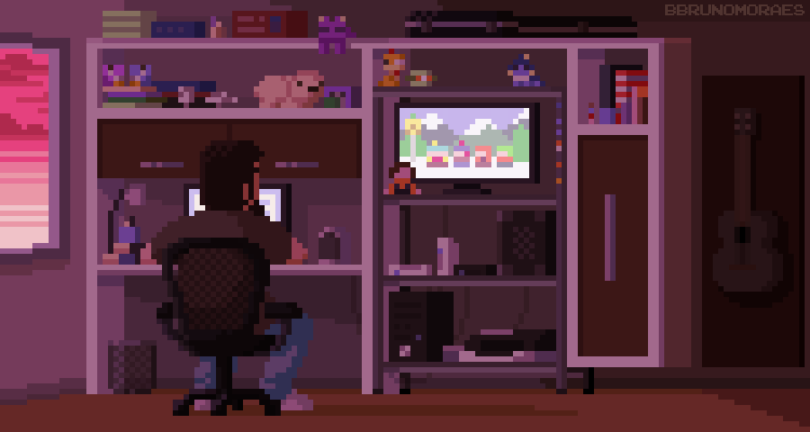

  

  

<h2 align="center">Hi there 👋, I'm Sergiy!</h2>
<h3 align="center">To get in touch with me:</h3>

 <a href="https://www.linkedin.com/in/ephemerian/" target="_blank" rel="noreferrer">Linkedin</a> /
 <a href="mailto:veryovkasergiy@gmail.com" target="_blank" rel="noreferrer">Gmail</a>

<h3 align="center" style="padding: 20px 0; font-size: 20px; font-weight: 700; letter-spacing: 0.1em; color: #7928ca;">Languages and Tools:</h3>

    
    
    
    
    
    
    

  

